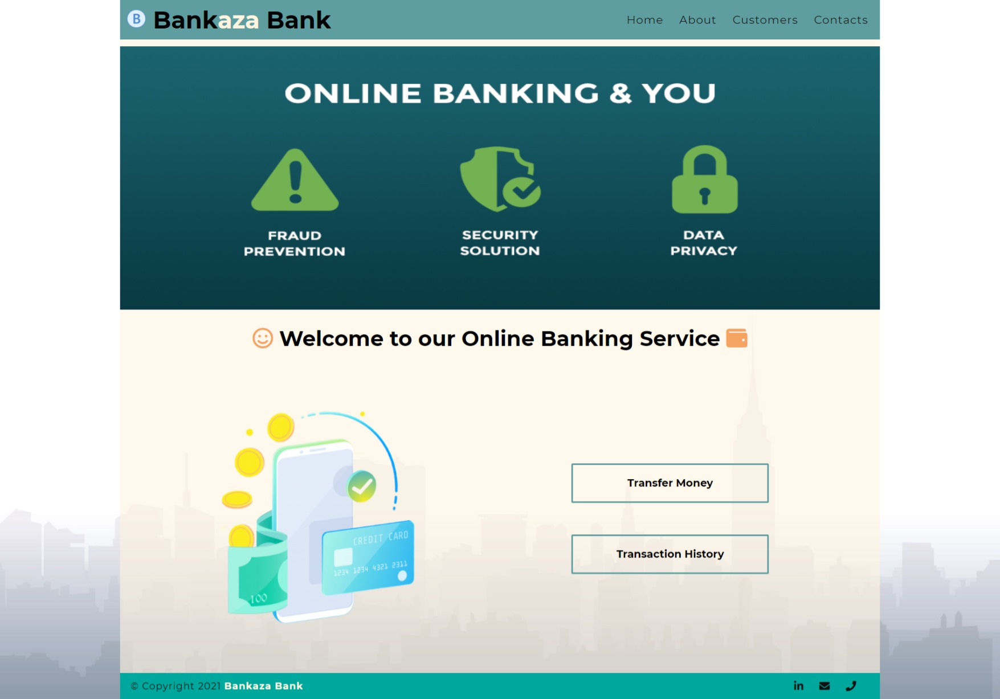

# Basic_Banking_System
This is a simple Banking System made using PHP and JavaScript.

# Restaurant-web
Restaurant-web is a simple restaurant website template, build with HTML and CSS.

# Build With
<ul>
  <li><a href="https://www.w3schools.com/html/">HTML</a> - Structure of Web Page</li>
  <li><a href="https://www.w3schools.com/css/">CSS</a> - Styling of Web Page</li>
  <li><a href="https://www.w3schools.com/bootstrap/bootstrap_ver.asp">BootStrap</a> - Open-source CSS Framework</li>
  <li><a href="https://www.w3schools.com/js/">JavaScript</a> - Programming Language for the Web Page</li>
  <li><a href="https://www.w3schools.com/php/">PHP</a> - Server Scripting Language of Web Page</li>
  <li><a href="https://www.w3schools.com/sql/">SQL</a> - Database</li>
  <li><a href="https://fontawesome.com/">Font Awesome</a> - The iconic SVG, font, and CSS toolkit</li>
  <li><a href="https://fonts.google.com/">Google Fonts</a> - Library of libre licensed fonts</li>
</ul>

# Author
<a href="https://github.com/reddykumaraswamy">Reddy Kumaraswamy</a> (author)

# Website Look - Image

# Copyright & License
 &copy;Reddy Kumaraswamy 2021 All Rights Reserved.
